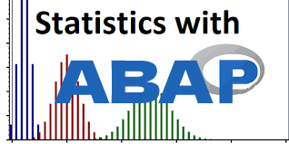
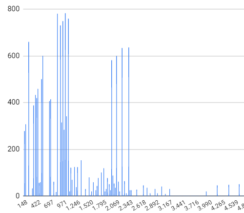

# ABAP Statistical Tools


Statistics with ABAP: why not? This project consist of an ABAP class `ztbox_cl_stats` where some of the most common descriptive statistics functions have been included together with simple tools to generate distributions and produce empirical inference analyses.

## Basic Features & Elementary Statistics
Let's compute some statistics on `SBOOK` table
```abap
SELECT * FROM sbook INTO TABLE @DATA(T_SBOOK).

DATA(stats) = NEW ztbox_cl_stats( t_sbook ).
```

Use `->col( )` method to select a column on which make calculations

```abap
DATA(prices) = stats->col( `LOCCURAM` ).
```

Each statistic has its own method

```abap
* The smallest value
DATA(min)        = prices->min( ).                       " [148.00]

* The largest value
DATA(max)        = prices->max( ).                       " [6960.12]

* The range, i.e. the difference between largest and smallest values
DATA(range)      = prices->range( ).                     " [6812.12]

* The sum of the values
DATA(tot)        = prices->sum( ).                       " [25055655.41]

* The sample mean of the values
DATA(mean)       = prices->mean( ).                      " [922.96]

* The mean absolute deviation (MAD) from the mean
DATA(mad_mean)   = prices->mad_mean( ).                  " [480.41]

* The sample median of the values
DATA(median)     = prices->median( ).                    " [670.34]

* The mean absolute deviation (MAD) from the median
DATA(mad_median) = prices->mad_median( ).                " [436.36]

* The sample variance of the values
DATA(variance)   = prices->variance( ).                  " [572404.48]

* The sample standard deviation of the values
DATA(std_dev)    = prices->standard_deviation( ).        " [756.57]

* The coefficent of variation, ratio of the standard deviation to the mean
DATA(coeff_var)  = prices->coefficient_variation( ).     " [0.819]

* The dispersion index, ratio of the variance to the mean
DATA(disp_index) = prices->dispersion_index( ).          " [620.18]

* The number of distinct values
DATA(dist_val)   = prices->count_distinct( ).            " [324]

* The number of not initial values
DATA(not_init)   = prices->count_not_initial( ).         " [27147]
```

Alternatively, you can use the main instance, which represents the entire table, passing the name of the relevant column:

```abap
DATA(min_price)  = stats->min( `LOCCURAM` ).
```

## More specific descriptive statistics

### Quartiles
25% of the data is below the *first quartile* $Q1$

```abap
DATA(first_quartile) = prices->first_quartile( ). " [566.10]
```

50% of the data is below the *second quartile* or *median* $Q2$

```abap
DATA(second_quartile) = prices->second_quartile( ). " [670.34]
DATA(median)          = prices->median( ). " It's just a synonym for second_quartile( )
```

75% of the data is below the *third quartile* $Q3$

```abap
DATA(third_quartile) = prices->third_quartile( ). " [978.50]
```

The difference between third and first quartile is called *interquartile range* $\mathrm{IQR} = Q3 - Q1$, and it is a measure of spread of the data

```abap
DATA(iqr) = prices->interquartile_range( ). " [412.40]
```

A value outside the range $\left[Q1 - 1.5\mathrm{IQR},\ Q3 + 1.5\mathrm{IQR}\right]$ can be considered an *outlier*
```abap
DATA(outliers) = prices->outliers( ). " Found 94 outliers, from 1638.36 to 6960.12
```

### Means

Harmonic Mean is $\frac{n}{\frac{1}{x_1}\+\ \ldots\ +\ \frac{1}{x_n}}$, used often in averaging rates

```abap
DATA(hmean) = prices->harmonic_mean( ). " [586.17]
```

Geometric Mean is $\sqrt[n]{x_1\cdot \ldots \cdot x_n}$, used for population growth or interest rates

```abap
DATA(gmean) = prices->geometric_mean( ). " [731.17]
```

Quadratic Mean is $\sqrt{\frac{x_1^2\ +\ \ldots\ +\ x_n^2}{n}}$, used, among other things, to measure the fit of an estimator to a data set

```abap
DATA(qmean) = prices->quadratic_mean( ). " [1193.42]

* The values calculated so far confirm the HM-GM-AM-QM inequalities
* harmonic mean <= geometric mean <= arithmetic mean <= quadratic mean
```
 
### Moments

*Skewness* is a measure of the asymmetry of the distribution of a real random value about its mean. We estimate it with a sample skewness computed with the adjusted Fisher-Pearson standardized moment coefficient (the same used by Excel).

$$\mathrm{skewness} = \frac{n}{(n-1)(n-2)}\frac{\sum\limits_{i=1}^n {(x_i - \bar{x})}^3}{\left[\frac{1}{n-1}\sum\limits_{i=1}^{n} (x_i - \bar{x})^2 \right]^{3/2}}$$

```abap
DATA(skewness) = prices->skenewss( ). " [3.19] 
* positive skewness: right tail is longer, the mass of the distribution is concentrated on the left
```

*Kurtosis* is a measure of the tailedness of the distribution of a real random value: higher kurtosis corresponds to greater extremity of outliers

$$\mathrm{kurtosis} = \frac{1}{(n-1)}\frac{\sum\limits_{i=1}^n {(x_i - \bar{x})}^4}{\left[\frac{1}{n-1}\sum\limits_{i=1}^{n} (x_i - \bar{x})^2 \right]^2}$$

```abap
DATA(kurtosis) = prices->kurtosis( ). " [19.18]
* positive excess kurtosis (kurtosis minus 3): leptokurtic distribution with fatter tails
```

## Empirical Inference

The *histogram* is a table of couples $(\mathrm{bin}_i, \mathrm{f}_i)$ where $\mathrm{bin}_i$ is the first endpoint of the $i$-th *bin*, i.e. the interval with which the values were partitioned, and $\mathrm{f}_i$ is the $i$-th frequency, i.e. the number of values inside the $i$-th bin.

```abap
DATA(histogram) = prices->histogram( ).
```



The bins are created using *Freedman-Diaconis rule*: the bins width is $\frac{2\mathrm{iqr}}{\sqrt[3]{n}}$ where $\mathrm{iqr}$ is the interquartile range, and the total number of bins is $\mathrm{floor}\left(\frac{\mathrm{max} - \mathrm{min}}{\mathrm{bin\ width}}\right)$

Dividing each frequency by the total we get an estimate of the probability to draw a value in the corresponding bin, this is the *empirical probability*

```abap
DATA(empirical_prob) = prices->empirical_pdf( ).
```

Similarly, for each distinct value $x$, we can compute the number $\frac{\mathrm{number\ of\ elements}\ \le\ x}{n}$, this is the *empirical distribution function*

```abap
DATA(empirical_dist) = prices->empirical_cdf( ).
```

In order to answer the question "are the values normally distributed?" you can use method `->are_normal( )`

```abap
DATA(normality_test) = prices->are_normal( ) " [abap_false].
```

This method implements the [Jarque-Bera normality test](https://en.wikipedia.org/wiki/Jarque%E2%80%93Bera_test). The $p$-value is an exported parameter and the test is considered passed if $p\mathrm{-value} > 0.5$.

## Distributions

The following are static methods to generate samples from various distributions

```abap
" Continuous Uniform Distribution
DATA(uniform_values) = ztbox_cl_stats=>uniform( low = 1 high = 50 size = 10000 ).
" Generate a sample of 10000 values from a uniform distribution in the interval [1, 50]
" default is =>uniform( low = 0 high = 1 size = 1 )

" Continuous Normal Distribution
DATA(normal_values) = ztbox_cl_stats=>normal( mean = `-3` variance = 13 size = 1000 ).
" Generate a sample of 1000 values from a normal distribution with mean = -3 and variance 13
" default is =>normal( mean = 0 variance = 1 size = 1 )

" Continuous Standard Distribution
DATA(standard_values) = ztbox_cl_stats=>standard( size = 100 ).
" Generate a sample of 100 values from a standard distribution, i.e. a normal distribution with mean = 0 and variance = 1
" default is =>normal( size = 1 )

" Discrete Bernoulli Distribution
DATA(bernoulli_values) = ztbox_cl_stats=>bernoulli( p = `0.8` size = 100 ).
" Generate a sample of 100 values from a bernoulli distribution with probability parameter = 0.8
" default is =>bernoulli( p = `0.5` size = 1 )

" Discrete Binomial Distribution
DATA(binomial_values) = ztbox_cl_stats=>binomial( n = 15 p = `0.4` size = 100 ).
" Generate a sample of 100 values from a binomial distribution with probability parameter = 0.4 and number of trials = 15
" default is =>binomial( n = 2 p = `0.5` size = 1 )

" Discrete Geometric Distribution
DATA(geometric_values) = ztbox_cl_stats=>geometric( p = `0.6` size = 100 ).
" Generate a sample of 100 values from a geometric distribution with probability parameter = 0.6
" default is =>geometric( p = `0.5` size = 1 )

" Discrete Poisson Distribution
DATA(poisson_values) = ztbox_cl_stats=>poisson( l = 4 size = 100 ).
" Generate a sample of 100 values from a poisson distribution with lambda parameter = 4
" default is =>poisson( l = `1.0` size = 1 )
```

## Feature Scaling
In some cases can be useful to work with normalized data

```abap
DATA(normalized_prices) = prices->normalize( ).
" Each value is transformed subtracting the minimal value and dividing by the range (max - min)

DATA(standardized_prices) = prices->standardize( ).
" Each value is transformed subtracting the mean and dividing by the standard deviation
```

## Joint Variability
### Covariance
In order to compute the sample covariance of two columns call method `->covariance` passing the columns separated by comma

```abap
DATA(stats)      = NEW ztbox_cl_stats( t_sbook ).
DATA(covariance) = stats->covariance( `LOCCURAM, LUGGWEIGHT` ). " [1037.40]
```

### Correlation
The sample correlation coefficient is computed by calling `->correlation` method
```abap
DATA(stats)      = NEW ztbox_cl_stats( t_sbook ).
DATA(covariance) = stats->covariance( `LOCCURAM, LUGGWEIGHT` ). " [0.17]
```

## Aggregations
Each descriptive statistics explained so far can be calculated by first perform a group-by with other columns

```abap
DATA(stats)               = NEW ztbox_cl_stats( sbook ).
DATA(grouped_by_currency) = stats->group_by( `FORCURKEY` ).
" You can also perform a group-by with multiple columns, just comma-separate them
" e.g. stats->group_by( `FORCURKEY, SMOKER` ).
DATA(prices_per_currency) = grouped_by_currency->col( `LOCCURAM` ).
DATA(dev_cur)             = prices_per_currency->standard_deviation( ).
```

`dev_cur` is a table with two fields: the second one is a value containing the statistics computed (standard deviation in this example), the first one is a table with the group-by conditions: `group_field` contains the field grouped by (only `FORCURKEY` in this example) and `group_value` contains the corresponding value.

The same result can be obtained passing a table with the fields grouped by and a field named with the statistic to be computed:

```abap
TYPES: BEGIN OF ty_dev_cur,
         forcurkey          TYPE sbook-forcurkey,
         standard_deviation TYPE f,
       END OF ty_dev_cur.

DATA t_dev_cur TYPE TABLE OF ty_dev_cur.

prices_per_currency->standard_deviation( IMPORTING e_result = t_dev_cur ).
```

| FORCURKEY | STANDARD_DEVIATION |
| :---: | :---: |
| EUR	| 7.4552828433404977E+02 |
| USD	| 7.5823449440803665E+02 |
| GBP	| 6.7810223234147134E+02 |
| JPY	| 6.0950004556126635E+02 |
| CHF	| 8.1988721181761377E+02 |
| AUD	| 7.7221881749653369E+02 |
| ZAR	| 7.9085811097466910E+02 |
| SGD	| 1.0533820843863814E+03 |
| SEK	| 6.0380071198098267E+02 |
| CAD	| 7.8378300759376316E+02 |

# Contributions
Many features can be improved or extended (new distribution generators? implementing statistic tests?) every contribution is appreciated

# Installation
Install this project using [abapGit](https://abapgit.org/) 
